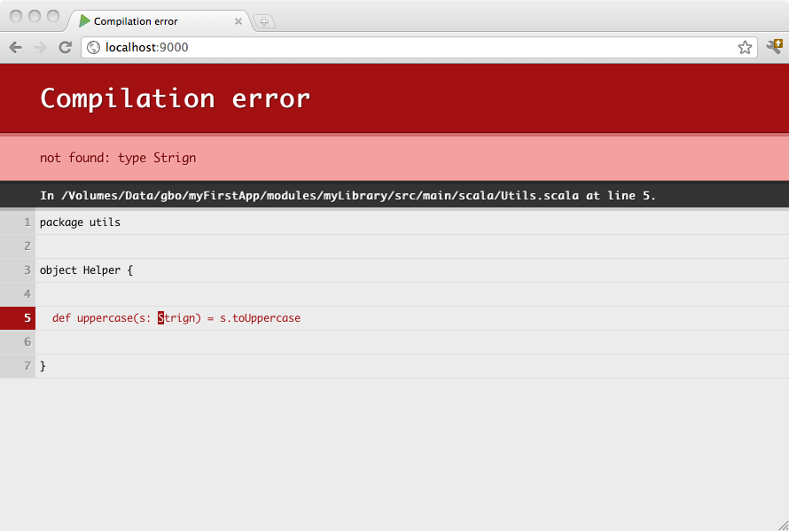

#使用 sub-projects 

一个复杂的项目不一定只有一个Play 应用组成。你可以把一个大项目分成几个小的应用，甚至你可以把一些和Play 应用没关系的逻辑提取到一些标准的JAVA 或SCALA 类库里面。

阅读这篇文章 [SBT documentation on multi-project builds](http://www.scala-sbt.org/release/docs/Getting-Started/Multi-Project).可以获得更多的帮助。sub-projects 没有它们自己的构建文件，它们和它们的父工程共享构建文件。

##添加一个简单的 sub-project

你可以让你的应用依赖一个简单的库工程。要做的只是在你的‘project/Build.scala’构建文件里面添加一个新的工程定义：

    import sbt._
    import Keys._
    import play.Project._
    object ApplicationBuild extends Build {
      val appName         = "my-first-application"
      val appVersion      = "1.0"
      val appDependencies = Seq(
        //if it's a java project add javaCore, javaJdbc, jdbc etc.
      )
      val mySubProject = Project("my-library", file("myLibrary"))
      val main = play.Project(
        appName, appVersion, appDependencies, path = file("myProject")
      ).dependsOn(mySubProject)
    }

在这里我们在应用的‘myLibrary’文件夹里定义了一个 sub-project。这个 sub-project 是一个标准的sbt 工程，使用默认的layout：

    myProject
     └ app
     └ conf
     └ public
    myLibrary
     └ src
        └ main
           └ java
           └ scala
    project
     └ Build.scala

当你在你的build 里面启用sub-project ，你可以只关注于这个子项目，单独编译测试运行它。可以在Play 控制台输入 project 命令来列出所有的项目。

    [my-first-application] $ projects
    [info] In file:/Volumes/Data/gbo/myFirstApp/
    [info]   * my-first-application
    [info]     my-library

默认的项目是项目名按字母排序的地一个项目。你可以使用aaaMain 命令来使用你的主要项目。你可以使用 project 命令来改变当前工程。

    [my-first-application] $ project my-library
    [info] Set current project to my-library

当你在开发模式下运行Play 应用，依赖的项目会自动编译，如果编译失败，你依然可以在浏览器里看到相关信息。

##把你的web分成几个小web

由于Play 应用只是一个含有默认配置文件的标准的sbt 工程，所以它可以依赖其它的Play 应用。

这个配置和之前的非常接近。配置你的 sub-project 就像配置 play.Project 一样简单。

    import sbt._
    import Keys._
    import play.Project._
        object ApplicationBuild extends Build {
          val appName = "zenexity.com"
          val appVersion = "1.2"
          val common = play.Project(
          	   appName + "-common", appVersion, path = file("common")
          )
      
          val website = play.Project(
              appName + "-website", appVersion, path = file("website")
          ).dependsOn(common)
      
          val adminArea = play.Project(
              appName + "-admin", appVersion, path = file("admin")
          ).dependsOn(common)
      
          val main = play.Project(
             appName, appVersion, path = file("main")
          ).dependsOn(
             website, adminArea
          )
    }

这里我们定义了一完整的被分割成两个部分的项目：website 部分和 admin 部分。这两个部分通过一个common 模块彼此依赖。

如果你想在编译测试主工程时同时依赖的子项目也重新编译和测试，那么你需要添加一个 “aggregate”选项。

    val main = PlayProject(
      appName, appVersion
    ).dependsOn(
      website, adminArea
    ).aggregate(
      website, adminArea
    )

注意：为了避免名字冲突，请确保你的sub-projects 的 controller 包括 Assets controller 使用和主项目不同的命名空间。

##分割route文件

由于 play 2.1 支持把 route 文件分割成为几部分。如果你想构建一个健壮的，可重用的多模块的Play 应用，这是一个非常方便的特性。

##考虑一以下构建文件

project/Build.scala

    import sbt._
    import Keys._
    import play.Project._
    object ApplicationBuild extends Build {
    val appName         = "myproject"
    val appVersion      = "1.0-SNAPSHOT"
    val adminDeps = Seq(
      // Add your project dependencies here,
       "mysql" % "mysql-connector-java" % "5.1.18",
      jdbc,
      anorm
    )
    val mainDeps = Seq()
    lazy val admin = play.Project(appName + "-admin", appVersion, adminDeps, path = file("modules/admin"))
    lazy  val main = play.Project(appName, appVersion, mainDeps).settings(
      // Add your own project settings here      
    ).dependsOn(admin).aggregate(admin)
}

###工程结构

    app
      └ controllers
      └ models
      └ views
    conf
      └ application.conf
      └ routes
    modules
      └ admin
        └ conf/admin.routes
        └ app/controllers
        └ app/models
        └ app/views     
    project
     └ build.properties
     └ Build.scala
     └ plugins.sbt

注意：只有一个application.conf 的实例，同时，在 admin 里面的route文件叫做 admin.routes。

conf/routes

    GET     /index                      controllers.Application.index()
        ->  /admin admin.Routes
    GET     /assets/*file               controllers.Assets.at(path="/public", file)

modules/admin/conf/admin.routes

    GET     /index                      controllers.admin.Application.index()
    GET     /assets/*file               controllers.admin.Assets.at(path="/public", file)

### Assets 和 controller 应当在  `controllers.admin` 包里面有定义

`modules/admin/controllers/Assets.scala`:

    package controllers.admin
    object Assets extends controllers.AssetsBuilder

注意：Java 版本的可以有更简单的实现方法，如：

    // Assets.java
    package controllers.my;
    public class Assets {
        //can be referenced as `controllers.my.Assets.delegate.at` in the route file
        public static controllers.AssetsBuilder delegate = new controllers.AssetsBuilder();
    }

一个 controller:

    package controllers.admin
    import play.api._
    import play.api.mvc._
    import views.html._
    object Application extends Controller {
      def index = Action { implicit request =>
        Ok("admin")
      }
    }

### `admin`里面的反转路由

对于常规的controller 调用：

    controllers.admin.routes.Application.index

对于Assets：

      controllers.admin.routes.Assets.at("...")

### 通过浏览器

    http://localhost:9000/index

触发

    controllers.Application.index

以及

    http://localhost:9000/admin/index

触发

    controllers.admin.Application.index

